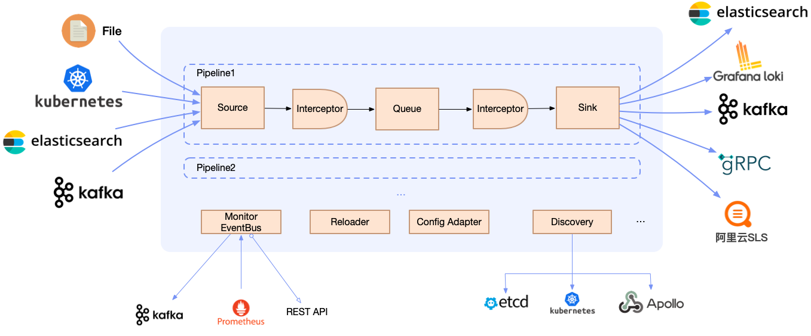

# php-dts

## 安装依赖

```
composer update
```

## 启动dts

```
php run.php start
```

## 停止dts

```
php run.php stop
```

## 重载dts

```
php run.php reload
```

## 配置示例：

```
<?php
namespace Config;
use Sink\PrintOut\PrintOut;
use Source\Canal\Source;

class Config {
    // pid文件
    private $pid_file = "/tmp/dts.pid";
    // 服务名字
    private $service_name = "dts";
    // 进程数
    private $worker_num = 1;
    // 重载间隔
    public $reload_time = 5000;
    // 管道配置
    private $pipeline = [
        // 源
        "source" => [
            [
                // source实例，可以通过实现不同source扩展
                "handle" => Source::class,
                // source的配置
                "config" => [
                    // canal ip
                    "ip" => "127.0.0.1",
                    // canal端口
                    "port" => 11111,
                    // canal clientid
                    "clientId" => "1001",
                    "destination" => "example",
                    "filter" => ".*\\..*",
                    "reader" => [
                        // 从canal 读取数据的协程数目
                        "worker_count" => 1,
                    ]
                ]
            ],
        ],
        // 拦截器用来处理数据
        "intercept" => [

        ],
        // sink
        "sink" => [
            // sink 并发度
            "parallelism" => 3,
            // 输出实现类，到控制台，可以自己实现扩展
            "handle" => PrintOut::class,
            // sink配置
            "config" => []
        ],
        // 数据sink 发送失败后是否重试
        "retry" => true,
    ];

    public function getConfig() {
        return [
            "pid_file" => $this->pid_file,
            "service_name" => $this->service_name,
            "worker_num" => $this->worker_num,
            "pipeline" => $this->pipeline,
            "reload_time" => $this->reload_time
        ];
    }
}

```

## 代码架构

#### 核心数据流

- **Source**：输入源，表示一个具体的输入源，一个Pipeline可以有多个不同的输入源。比如canal source表示mysql canal采集源。
- **Sink**：输出源，表示一个具体的输出源，一个Pipeline仅能配置一种类型的输出源，但是可以有多个并行实例。比如PrintOut sink表示日志数据将发送至标准输出。
- **Interceptor**：拦截器，表示一个日志数据处理组件，不同的拦截器根据实现可以进行canal数据的解析、切分、转换、限流等。一个Pipeline可以有多个Interceptor，数据流经过多个Interceptor被链式处理。
- **Queue**：队列，目前有Channel内存队列。
- **Pipeline**：管道，source/interceptor/queue/sink共同组成了一个Pipeline，不同的Pipeline数据隔离。



#### 多协程从canal读取数据

Reader 模块:
```
    public function start($productFunc) {
        Coroutine::create(function () use ($productFunc) {
            $this->isRun = true;
            $this->work($productFunc);;
        });
    }
```

Pipeline从Source发往channel的数据，发往下游sink :
```
        for ($i = 0; $i < $parallelism; $i++) {
            \Swoole\Coroutine::create(function () {
                $this->sinkInvokeLoop();
            });
        }
```

swoole 协程简单示例：
https://wiki.swoole.com/zh-cn/#/coroutine/channel
```
use Swoole\Coroutine;
use Swoole\Coroutine\Channel;
use function Swoole\Coroutine\run;

run(function(){
    $channel = new Channel(1);
    Coroutine::create(function () use ($channel) {
        for($i = 0; $i < 10; $i++) {
            Coroutine::sleep(1.0);
            $channel->push(['rand' => rand(1000, 9999), 'index' => $i]);
            echo "{$i}\n";
        }
    });
    Coroutine::create(function () use ($channel) {
        while(1) {
            $data = $channel->pop(2.0);
            if ($data) {
                var_dump($data);
            } else {
                assert($channel->errCode === SWOOLE_CHANNEL_TIMEOUT);
                break;
            }
        }
    });
});

```
